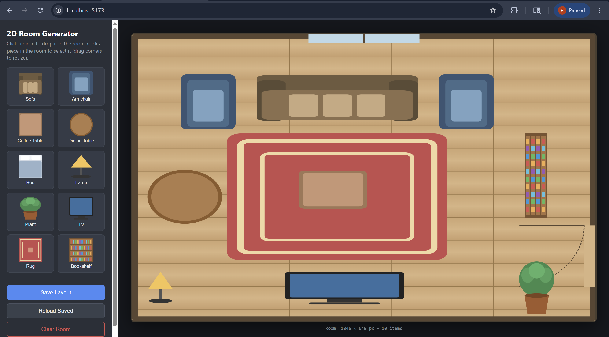
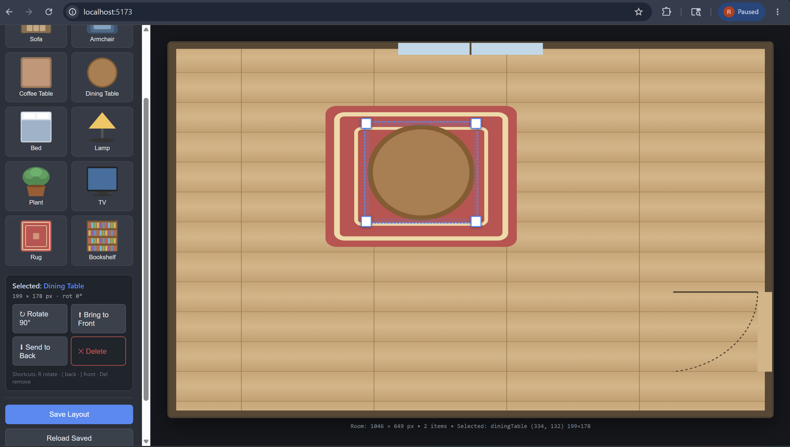
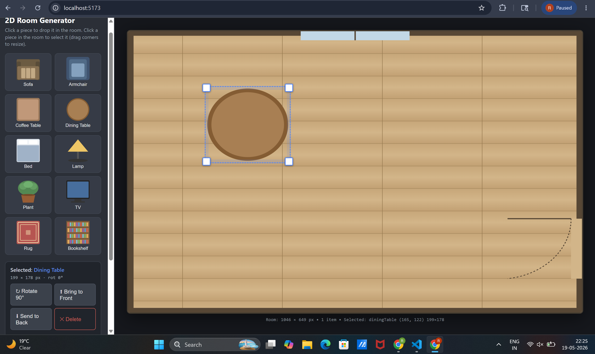
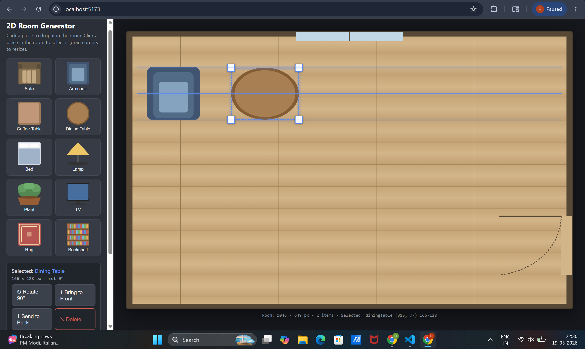

# 2D Room Generator

A prototype interior-design web application. Pick furniture from the sidebar, drop it into a virtual room, drag it around (with alignment guides + snap), resize it, rotate it, layer it, then save the layout to disk through a Node.js backend. Reload the saved layout at any time to keep editing.

---

## Quick Start

**Install** (single line):

```bash
git clone <this-repo-url> room-generator && cd room-generator && npm run setup
```

**Run** (single line, from inside the cloned folder):

```bash
npm start
```

Then open **http://localhost:5173** in your browser. The backend runs on **http://localhost:4000**.

- The `room-generator` argument in `git clone` forces the target directory name, so the command works regardless of what the GitHub repository itself is called.
- `npm run setup` installs dependencies for the root, server, and client in one step.
- `npm start` boots the Express API and the Vite React dev server together via `concurrently`.

A sample layout ([server/layouts/layout.json](server/layouts/layout.json)) ships with the repo, so on first launch the room appears already furnished — useful for screenshots and quick evaluation.

---

## Features

### Core
- **Responsive React + Vite frontend** with a clearly defined Empty Room workspace (drawn as a top-down SVG floor plan with walls, a window, and a door — guaranteed empty and offline-friendly).
- **Sidebar catalog** of furniture assets: sofa, armchair, coffee table, dining table, bed, lamp, plant, TV, rug, bookshelf. Click any item to drop it into the room.
- **Drag-anywhere** inside the room. Furniture is constrained to the interior of the visible walls (not just the room border).
- **Resize via corner / edge handles** (`react-rnd`). Handles light up only when the item is selected. Each catalog entry has a sensible `minWidth` / `minHeight` so items can't be shrunk into oblivion.
- **The room stays fixed** while objects are resized — resizing only mutates the item's record; the canvas geometry is never touched.
- **Continuous spatial-state tracking**: every item carries `{id, type, x, y, width, height, zIndex, rotation}`. A live status bar under the room reports the selected piece's coordinates and dimensions in real time.

### Item manipulation
- **Rotate**: click "↻ Rotate 90°" in the sidebar or press `R`. Rotation is in 90° steps; the bounding box swaps width/height so resize and snap continue to work.
- **Layering**: explicit "⬆ Bring to Front" / "⬇ Send to Back" (or `]` / `[`). Clicking an item *does not* auto-raise it — so you can keep a rug under a sofa without having to fight z-order.
- **Alignment guides + snap-on-drop**: while dragging an item, blue 1-px guide lines appear when its left / center / right or top / center / bottom edge comes within ~6 px of another piece's matching edge. On release, the item snaps to the nearest alignment in each axis.
- **Delete**: select an item and press `Delete` / `Backspace`, or click "✕ Delete" in the sidebar.

### Persistence
- **Save Layout**: POSTs the full payload to the backend, which writes `server/layouts/layout.json` plus a timestamped history snapshot (e.g. `layout-2026-05-18T19-30-04-117Z.json`).
- **Reload mechanism**: the app auto-fetches `GET /api/layout` on first mount; the **Reload Saved** button is a manual trigger for the same flow.

---

## Screenshots

### Demo Layout
The sample layout that ships with the repo: rug centered, sofa above it, armchairs flanking, coffee table on the rug, TV on the south wall, dining table in the bottom-left, lamp in the corner, plant opposite, and a vertical bookshelf along the right wall.



### Layering Demo
A rug placed on top of a table, then the table brought above the rug using **Send to Back / Bring to Front**. Demonstrates explicit z-ordering: clicking does not change the stack — only the layering buttons do.



### Resizing Items
An item selected, showing the white-square corner handles and blue dashed selection outline. Drag any corner / edge to resize; the live readout under the room shows the new W × H. The room itself never changes size.



### Alignment Functionality
Dragging a piece while its edge approaches another piece's edge: 1-px blue alignment guides appear along the matching axes. Releasing snaps the item to the alignment. Guides fire on left/center/right and top/center/bottom edges.



---

## Backend API

| Method | Path           | Purpose                                              |
| ------ | -------------- | ---------------------------------------------------- |
| GET    | `/api/health`  | Liveness check.                                      |
| POST   | `/api/layout`  | Persist a layout payload to disk.                    |
| GET    | `/api/layout`  | Return the most recently saved layout.               |

### Save payload schema

```json
{
  "version": 1,
  "room": { "width": 1014, "height": 760 },
  "items": [
    {
      "id": "sample_sofa",
      "type": "sofa",
      "x": 270,
      "y": 70,
      "width": 380,
      "height": 120,
      "rotation": 0,
      "zIndex": 3
    }
  ]
}
```

The server attaches a `savedAt` ISO timestamp, writes `server/layouts/layout.json` (the canonical "latest"), **and** drops a timestamped copy so prior sessions can be recovered.

### Reload mechanism

The saved metadata contains everything needed to fully rehydrate the editing session:

| Field        | Purpose                                                                     |
| ------------ | --------------------------------------------------------------------------- |
| `type`       | Reproduces the visual asset via the catalog                                 |
| `id`         | Stable identifier so future edits target the same item                      |
| `x, y`       | Position relative to the room interior                                      |
| `width, height` | Bounding-box dimensions (post-rotation)                                  |
| `rotation`   | 0 / 90 / 180 / 270 — re-applies the same orientation                        |
| `zIndex`     | Re-establishes stacking order                                               |
| `room`       | Saved alongside items so future versions can rescale for different screens  |

On mount the client calls `GET /api/layout` automatically; the **Reload Saved** button is a manual trigger for the same flow.

---

## Keyboard shortcuts

| Key                | Action                              |
| ------------------ | ----------------------------------- |
| `R`                | Rotate selected item 90° clockwise  |
| `]`                | Bring selected item to front        |
| `[`                | Send selected item to back          |
| `Delete` / `Backspace` | Remove selected item            |

---

## Edge cases — and how they are handled

| #  | Edge case                                                                  | Current handling                                                                                                                                              |
| -- | -------------------------------------------------------------------------- | ------------------------------------------------------------------------------------------------------------------------------------------------------------- |
| 1  | User drags a piece past the room edge.                                     | `react-rnd` has `bounds="parent"` referencing an inset `.room-interior` div, so items stop at the visible wall (not the outer room border).                   |
| 2  | User shrinks a piece below a usable size.                                  | Each catalog entry declares `minWidth` / `minHeight`; react-rnd refuses to resize past the floor.                                                             |
| 3  | Resizing accidentally changes the room.                                    | The room is a fixed `aspect-ratio: 4/3` parent; only `.furniture` children resize. The save logic only mutates the item record, never the canvas.             |
| 4  | Backend is down when **Save** is clicked.                                  | Status pill flips to "Save failed — is the server running?" and reverts after 3 s. Client-side state is untouched, so retry is safe.                          |
| 5  | Backend is down on initial mount.                                          | Auto-load fetch fails silently; the user gets an empty room and can keep working. The manual **Reload Saved** button surfaces an explicit alert.              |
| 6  | User opens a saved layout on a smaller screen than the one it was saved on. | The saved `room.width/height` is stored. *Current:* items keep their absolute coords; `bounds="parent"` clamps them on first drag. *Planned:* scale positions by `(newRoomW/savedRoomW)` on load. |
| 7  | Two items overlap and the user wants the lower one on top.                  | Clicking does **not** change z-order. Explicit **Bring to Front** / **Send to Back** (or `]` / `[`) gives precise control.                                    |
| 8  | Item is selected but the user starts typing in an input.                   | The keyboard handler bails out when the focused element is an `INPUT` or `TEXTAREA`, so shortcuts don't hijack normal typing.                                  |
| 9  | Drag accidentally lands a piece a pixel away from a clean alignment.       | While dragging, alignment guides appear when edges/centers are within 6 px of another piece; on release the item snaps to the closest match.                  |
| 10 | A corrupt `layout.json` on disk.                                           | `GET /api/layout` wraps `JSON.parse` in try/catch and returns HTTP 500 with `{error}`; the client surfaces this as a reload error.                            |
| 11 | A saved file references a furniture `type` unknown to the current client.  | `FurnitureIcon` returns a neutral grey square for unknown types instead of crashing the render.                                                               |
| 12 | Many save clicks in rapid succession.                                      | The Save button is disabled while a save is in flight (`savingState === "saving"`).                                                                           |
| 13 | Browser refresh mid-edit (no save).                                        | In-flight unsaved state is lost. *Planned:* persist to `localStorage` on every change as a recovery cache.                                                    |
| 14 | A rotated item is then resized.                                            | The bounding-box width/height swap on rotation, so the resize handles always operate on axis-aligned dimensions and snap math stays correct.                  |
| 15 | The remote room image URL is blocked or offline.                           | The default room is a built-in SVG floor plan — no network dependency. The `ROOM_IMAGE` constant in `Room.jsx` can be set to a URL if a photo is preferred.    |

### Planned future hardening
- Free-angle rotation (currently fixed to 90° steps).
- Snap to grid + snap to the room walls (currently only snaps to other items).
- Multiple named layouts (`POST /api/layout/:name`) with a layout picker.
- Undo / redo stack.
- HTML5 drag-and-drop *from* the sidebar (currently click-to-add).
- Touch-friendly resize handles for tablets.
- `localStorage` recovery cache for unsaved edits.

---

## Running remotely

The app is portable to any host that exposes ports 5173 (frontend) and 4000 (backend). To run on a remote box:

```bash
ssh user@host
git clone <repo-url> room-generator && cd room-generator && npm run setup && npm start
```

Vite is started with `--host`, so it binds to `0.0.0.0` — point your browser at `http://<host>:5173`. The Vite proxy forwards `/api/*` to the local backend on 4000, so you don't need to expose port 4000 publicly.

---

